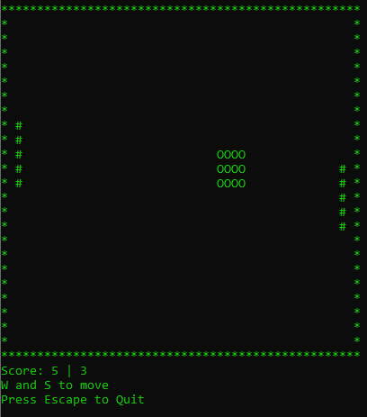

# Python Pong

This program is a simple pong game that plays in the console


# Development Environment

* Python 3.8.5

## Packages
* Install [PyPi Keyboard Package](https://pypi.org/project/keyboard/) using the console
```
pip install keyboard
```

# Execution
To execute the program:
```
python pong.py
```

## Controls
* Escape - Quit
* W Key - Move Paddle Up
* S Key - Move Paddle Down


## Screenshot

